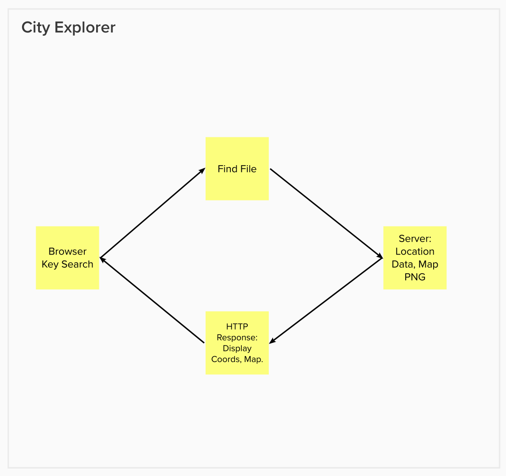

# Project Name

**Author**: Ian Forrester
**Version**: 1.0.0 (increment the patch/fix version number if you make more commits past your first submission)

## Overview

- A basic map website able to display an image of the location, along with the coordinates.

## Getting Started

- Added search bar and map image through axios. allowing users to search then display the desired location

## Architecture

## Change Log

09-26-2022 4:59pm - Application now has a fully-functional map and search bar.

## Credit and Collaborations

- Julian Barker

## Name of feature: Implemented map and Search

- Estimate of time needed to complete: 4 hrs

- Start time: 2:30pm

- Finish time: 5:10pm

- Actual time needed to complete: 3hrs
